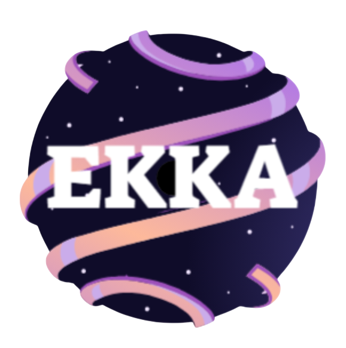

# EKKA AI - Advanced AI Chat Interface

EKKA AI is a sophisticated, full-stack AI chat application inspired by modern LLM interfaces like Claude. It features a high-performance React frontend and a robust Node.js backend, integrating with NVIDIA NIM for high-speed model inference and Supabase for real-time data persistence and authentication.



## 🚀 Key Features

- **Multi-Model Support**: Seamlessly switch between various LLMs, including Mistral Nemotron and NVIDIA Nemotron models.
- **Claude-style Artifacts**: Dedicated side panel for rendering code, documents, and interactive previews.
- **Real-time Streaming**: Fluid, low-latency message streaming with a custom visual typing effect for a natural feel.
- **Conversation Management**: Full history tracking, renaming, deleting, and exporting of chats.
- **Secure Authentication**: Robust user login and session management powered by Supabase.
- **Rich Markdown Support**: Full support for GFM, LaTeX (via KaTeX), and syntax-highlighted code blocks.
- **Responsive UI**: Beautifully designed with Tailwind CSS, featuring a collapsible sidebar, dark/light modes, and framer-motion animations.
- **Keyboard Shortcuts**: Power-user friendly with integrated shortcuts for quick navigation and actions.

## 🛠️ Tech Stack

### Frontend
- **Framework**: React 19 + Vite
- **Styling**: Tailwind CSS + Framer Motion
- **State/Auth**: Supabase JS SDK
- **Icons**: Lucide React
- **Content**: React Markdown + rehype-katex + highlight.js

### Backend
- **Runtime**: Node.js (Express)
- **AI Integration**: NVIDIA NIM (OpenAI-compatible API)
- **Middleware**: Morgan, CORS, Express Rate Limit

## 🏁 Getting Started

### Prerequisites
- Node.js (v18 or higher)
- A Supabase project
- An NVIDIA NIM API Key

### Installation

1. **Clone the repository**:
   ```bash
   git clone <repository-url>
   cd gemini-calude-ai
   ```

2. **Backend Setup**:
   ```bash
   cd backend
   npm install
   ```
   Create a `.env` file in the `backend` folder:
   ```env
   PORT=5000
   NVIDIA_API_KEY=your_nvidia_api_key
   FRONTEND_URL=http://localhost:5173
   # Optional: API_KEY=your_openrouter_key
   ```
   Start the server:
   ```bash
   npm start
   ```

3. **Frontend Setup**:
   ```bash
   cd ../claude-clone
   npm install
   ```
   Create a `.env` file in the `claude-clone` folder:
   ```env
   VITE_SUPABASE_URL=your_supabase_url
   VITE_SUPABASE_ANON_KEY=your_supabase_anon_key
   VITE_API_URL=http://localhost:5000
   ```
   Start the development server:
   ```bash
   npm run dev
   ```

## 📁 Project Structure

- `backend/`: Express server handling LLM API requests and rate limiting.
- `claude-clone/`: React frontend with modular components, hooks, and UI utilities.
  - `src/components/chat/`: Core chat logic (Message, InputArea, Auth).
  - `src/components/layout/`: Structural components (Sidebar, Navbar, ArtifactPanel).
  - `src/components/ui/`: Reusable, animated UI components.
  - `src/hooks/`: Custom React hooks for theme, shortcuts, and data fetching.

## 📄 License

This project is licensed under the ISC License.
